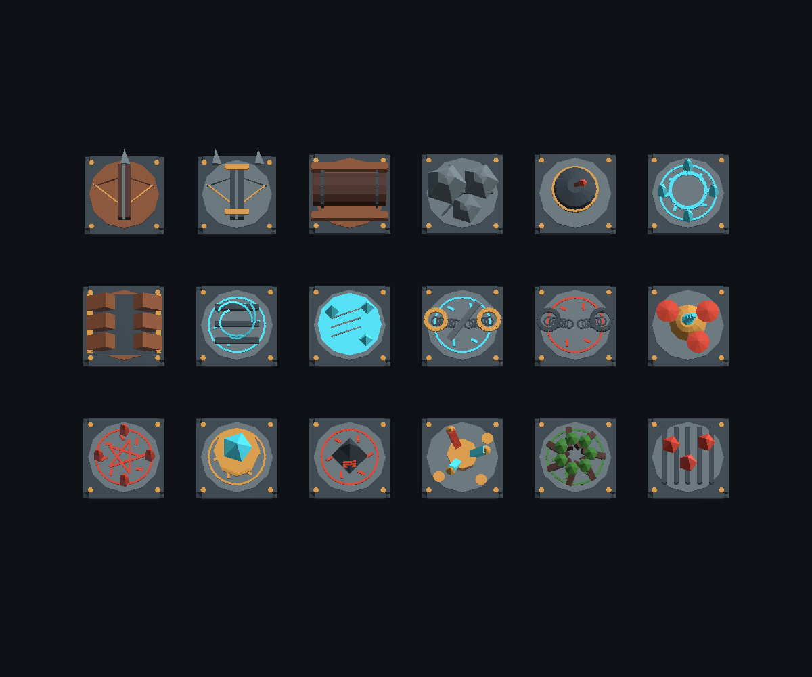

# Fantasy dungeon traps

18 reusable environmental trap types use a 50% activation roll per eligible entry. Party members can discover hidden traps; enemies trigger only traps that are already revealed. Enemies crossing hidden traps do not reveal them, roll activation, or emit trap events, including during forced movement. Failed rolls show **Evaded**; successful rolls record the result in event history. Player caltrops retain their separate enemy-only, single-use behavior.

Gallery order, left to right, top to bottom:

| Trap | Effect |
|---|---|
| Arrow | 10% maximum HP damage; arrow flies in from offscreen |
| Iron Arrow | 15% maximum HP damage; iron arrow flies in from offscreen |
| Rolling Log | 10% maximum HP damage and up to 2 tiles of push; log flies in from offscreen |
| Falling Rock | 15% maximum HP damage |
| Bomb | 15% maximum HP damage to each unit within 1 tile |
| Warp | Relocate to a free, reachable cell on this floor |
| Pitfall | 10% maximum HP damage and same-floor relocation |
| Updraft | Launch up to 3 tiles; only landing triggers another trap |
| Ice Slick | Slide up to 3 tiles; traversed traps can activate |
| Disarm | Drop one equipped item nearby, preserving its instance |
| Shadow Bind | Block movement for 3 turns |
| Hallucination | Confusion for 3 turns |
| Summoning | Spawn up to 2 nearby, floor-appropriate non-boss enemies |
| Transformation | Animate one ordinary dropped item within 2 tiles; defeat the monster to recover it |
| Withering Hex | Weaken and silence for 3 turns |
| Clumsy Jinx | Drop up to 3 unequipped bag entries nearby |
| Blight | Change one food unit into spoiled food (25% restoration) |
| Scorch | Change one food unit into charred food (50% restoration) |

Damage rounds up with a minimum of 1. Movement respects walls, occupied footprints and movement binds. Chaining attempts each trap at most once and stops after eight traps per resolution. All random outcomes and gameplay mutations happen before playback; skipping animations does not change them.

Party bag effects use the shared inventory. Enemies affect only their own carried items or equipment. Protected items cannot be transformed or disarmed. Drops reserve free reachable floor space before transferring ownership. Food tags and variant references are explicit; bread is the current food asset. Spoiled/charred definitions resolve by name when restoring saved inventory.

Units (including downed allies) and dropped items found in walls are moved to random valid floor positions between actions/turns. Unit recovery checks the whole footprint and occupancy; item recovery preserves the exact item. If no legal destination exists, recovery retries when one becomes available.

## Asset workflow

- Source: `ArtSource/FantasyTraps/FantasyTraps.blend`, created through Blender MCP.
- Rebuild: execute `Tools/Art/generate_fantasy_traps.py` through Blender MCP. It creates an isolated scene and preserves existing scenes.
- Unity: run **Tools / Eternal Enigma / Art / Import Fantasy Traps**. This imports meshes, generates 18 prefab definitions and four status prefabs, and registers food variants.
- Models and the separate log/arrow projectile meshes use the shared dungeon palette, XY floor orientation, and negative-Z height. They have no gameplay colliders.
- Trap kind integer values define seeded generation order; do not reorder them.

## Verification

Run **Tests / Run Fantasy Traps** for effect, item, placement, generation catalogue, and gallery checks. Run **Tests / Run Fantasy Trap Playback** for offscreen projectile motion, animation skipping, floating Evaded text, and explanatory event history. The focused fixtures do not depend on the floor-introduction animation.
